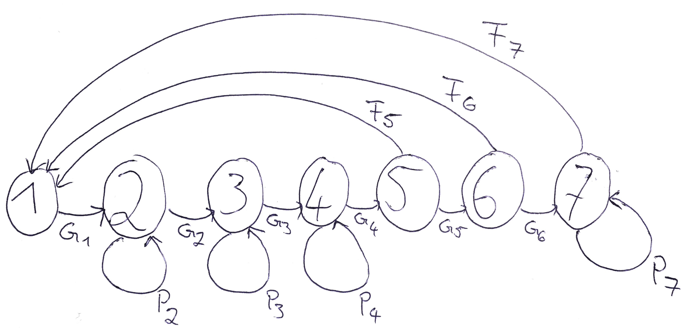
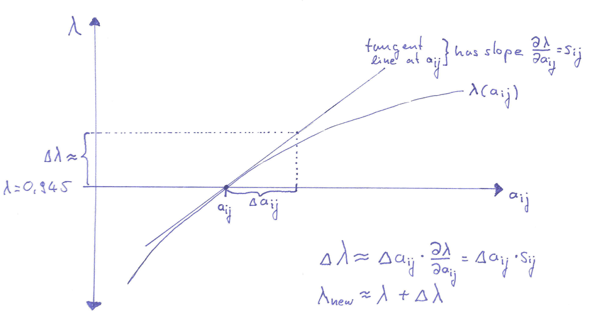

```{r setup, include=FALSE}
knitr::opts_chunk$set(echo = TRUE)
```

```{r klippy, echo=FALSE, include=TRUE}
klippy::klippy(position = c('top', 'right'))
```


### 2
**Draw the life-cycle diagram corresponding to the population projection matrix given in Table 4. Mark the arrows with the appropriate symbol ($F_{i}$ for fertilities, $G_{i}$ for growth, $P_{i}$ for staying in a state).**




### 3
**Why do the authors prefer to describe the life cycle with a size-structured model rather than an age-structured model?**

page 1413: insufficient age-based data

- "no method has yet been devised to obtain accurate ages of sea turtles"
- "the shells are generally too thin and fragile to hold a reliable tag for long"
- "resulting in inadequate estimates of nesting remigration (and thus fecundity) rates, survival and growth rates, and age at reproductive maturity"
- "The lack of reliable information on age-specific rates in marine turtles precludes the use of age-based population models, so stage class models must be employed."

page 1413: stage-based data easier to obtain

- Frazer himself, who analyzed an age-struture model, derived the age-specific parameter values from stage-specific data.
- "A few stages (eggs, hatchlings, and mature, nesting adults) are biologically distinct and easily recognized, and some estimates of survival rates are becoming available for these stages."
- "Most researchers have used size (as measured by carapace length) as an index of age in marine turtles, so size-based stage classes seem appropriate."

page 1414-15: stage-based model of lower dimensionality

- "In addition to the fact that a stage class approach is better supported by the data, one major advantage over using an age class model based on Frazer's life table is that simulations can be performed with a 7 x 7 matrix, instead of an unwieldy 54 x 54 matrix, thereby minimizing error propagation
caused by repeated multiplication of parameters."

<!-- Briefly discuss the quality of the demographic data. Where do you see the largest uncertainty in the accuracy of the demographic data? Do you have (feasible!) suggestions for how to improve the estimates for the vital rates and the matrix entries that would allow for more accurate predictions? -->

### 4 
**Briefly explain the connection between Table 3 and Table 4. How do the entries in the first determine the entries in the second?**

Table 3 shows the assumed relationship size classes and age. Furthermore, it shows the estimated annual survival probabilities for each size class and the fecundities for the last three age classes.

Table 4 shows the population projection matrix for a size-structured model. The entries for the stage-based survival and growth probabilities are derived from the age-based survival probabilities according to equations (1) and (2).

<!-- Eqs.~(1) and (2) explain how the parameters of an age-structured model (age-specific probabilities $p_{i}$ to survive from one year to the next) are used to calculate the stage-specific probabilities to survive and either stay in the same stage-class from one year to the next (the parameters $P_{i}$) or to move to the next stage-class (the probabilities $G_{i}$). This part of the paper is not so easy. Can you nevertheless try to explain the basic idea behind these calculations? -->

### 5
**Determine whether the population projection matrix for the loggerhead sea turtle is reducible or irreducible, and whether it is imprimitive or primitive. What are the implications of your conclusion for the way you can analyze this model?**

The matrix is irreducible since all stages can be reached from any other stage by moving along the arrows. Furthermore, the matrix is primitive. The way to see this is by noticing that the life cycle graph has self-loops and that it has two neighboring classes that are able to reproduce.

The fact that the matrix is primitive implies that it has a unique real dominant eigenvalue and corresponding non-negative left and right eigenvectors. Thus, our results will be independent of the initial population vector $\mathbf N(0)$ tht we might choose for our simulations.

### 6
**Plot the population dynamics for a sufficiently long time until the time series clearly stops fluctuating. Present this plot both with densities on the y-axis and with log-densities on the y-axis. Use $\mathbf N(0)=(30, 25, 10, 5, 5, 2, 1)^\mathrm{T}$ as a vector of initial population densities. How long does the transient dynamics (during which the population fluctuates) roughly last?**

The matrix as defined in Table 4 equals

```{r}
M <- matrix(c(0, 0, 0, 0, 127, 4, 80,
              0.6747, 0.737, 0, 0, 0, 0, 0,
              0, 0.0486 ,0.661 , 0, 0, 0, 0,
              0, 0, 0.0147, 0.6907, 0, 0, 0,
              0, 0, 0, 0.0518 ,0 ,0 , 0,
              0, 0, 0, 0, 0.8091, 0, 0,
              0, 0, 0, 0, 0, 0.8091, 0.8089),	 # the data elements
  nrow = 7, # number of rows
  ncol = 7, # number of columns
  byrow = T) # fill matrix by rows

M

N.0 <- c(30, 25, 10, 5, 5, 2, 1) # vector of initial densities
length <- 50 # lenght of the time series

time.series <- matrix(0, nrow=nrow(M), ncol=length+1) # creates a matrix with three rows and (length+1) columns in which the simulated time series will be stored
time.series[ ,1] <- N.0 # stores N.0 in the first column of the matrix `time.series'
for (i in 1:length){# executes the matrix multiplication as often as specified by the parameter length and stores result in the matrix time.series
 time.series[ , i+1] <- M %*% time.series[ , i]
}

matplot(0:length, t(time.series), type="l", lty=1:7, col = 1:7, ylab = "stage abundance", xlab = "year") # plots result
legend("topright", legend = c("stage 1", "stage 2", "stage 3", "stage 4", "stage 5", "stage 6", "stage 7"), lty = 1:7, col = 1, bty = "n") # defines legend

matplot(0:length, t(time.series), type="l", lty=1:7, col = 1:7, log="y", ylab = "log stage abundance", xlab = "year") # plots result on log scale
legend("topright", legend = c("stage 1", "stage 2", "stage 3", "stage 4", "stage 5", "stage 6", "stage 7"), lty = 1:7, col = 1:7, bty = "n") # defines legend
```

The dynamics enter a phase of exponential decline after roughtly 15 time steps.

### 7
**Describe the procedure used by the authors to compute the dominant eigenvalue and the corresponding right and left eigenvectors of the population projection matrix. How does this compare to your method?**

The authors describe their method on page 1416, first column. This method is exactly equal to the method you use with your *R*-code.

"For each simulation, the power method (Searle 1966, Keyfitz 1977) was used to take successively higher powers of the matrix and postmultiply by the population vectors until the resultant vectors differed frome ach other by only a scalar factor; this factor is $\lambda$ (the dominant eigenvalue) and the vector is proportional to the right eigenvector $\mathbf w$. The population vectors at this point represent the right eigenvector or stable stage distribution."

"The left eigenvector $\mathbf v$ can be found by applying the same procedure to the transposed matrix."

### 8
**Compute the dominant eigenvalue $\lambda$ and additionally express it as $r$, the intrinsic rate of increase.**

```{r}
lambda <- time.series[1, length+1]/time.series[1, length] # ratio of population size at the end of the time series for age-class 1. This gives lambda
lambda
log(lambda)
```

These values for $\lambda$ and $r$ are equal to those given in the paper on page 1416 in the left column.

### 9
**Compute the stable stage distribution (called $\mathbf w$ in this paper). Present the result in a standardized manner such that its entries sum up to 1. Compare your result with the numbers given in Table 5 of the paper.**

```{r}
total = sum(time.series[ , length+1]) # total population size at the end of the time series (i.e., the right eigenvector)
rightEV = time.series[ , length+1]/total # Right eigenvector standardized such that its entries sum up to one. This vector represents proportions in the stable age distribution

rightEV # prints stable age distribution
```

This is the same result as in the paper.

### 10
**Compute the vector of reproductive values $\mathbf v$. Present the result in a standardized manner such that the reproductive value of individuals in state 1, $v_{1}$, equals 1. Compare your result with the numbers given in Table 5 of the paper.**

```{r}
transM <- t(M) # transpose of the population projection matrix
time.series.transpose <- matrix(0, nrow=nrow(M), ncol=length+1)
time.series.transpose[ , 1] <- N.0
for (i in 1:length){
  time.series.transpose[ , i+1] <- transM %*% time.series.transpose[ , i]
}
matplot(0:length, t(time.series.transpose), type="l", lty=1:3, col = 1, log="y", xlab = "year", ylab = "something that is NOT density")

leftEV = time.series.transpose[ , length+1]/time.series.transpose[1, length+1] # left eigenvector containing reproductive values with the reproductive value for the first age-class standardized to 1
leftEV
```

This vector agrees with the vector given in Table 5.

### 11
**Compute the sensitivity matrix, i.e., the matrix that contains in each position the partial derivative of $\lambda$ with respect to the corresponding matrix entry $a_{ij}$ (just as we did in the *R*-exercise yesterday).**

Note that the authors do not present the sensitivity matrix in their paper.

```{r}
outer.product <- outer(leftEV, rightEV)
inner.product <- (rightEV %*% leftEV)[1]

sensitivities <- outer.product/inner.product
sensitivities # print sensitivities
```

<!--
### 12
Try to reproduce figure 1(b) from the paper.

I realized that it is not clear from the descriptions given in the paper how the authors themselves produced figure 1. Specifically, from the legend it is not clear which matrix entries they changed in each run or if they changed the $p_i$-values given in equation (1) and (2).

Scientific papers should always be written in a manner that the reader can reproduce the results. This is not quite possible here without some try and error. I therefore suggested to drop this question. 

Thanks to Anna it is now clear how to do this:

```{r}
# Increasing fecundities with 50% (in the text they actually say that they double the numbers and this is what we do here) :

M.f <- matrix(c(0, 0, 0, 0, 127*2, 4*2, 80*2,
                0.6747, 0.7370, 0, 0, 0, 0, 0,
                0, 0.0486, 0.6610, 0, 0, 0, 0,
                0, 0, 0.0147, 0.6907, 0, 0, 0,
                0, 0, 0, 0.0518, 0, 0, 0,
                0, 0, 0, 0, 0.8091, 0, 0,
                0, 0, 0, 0, 0, 0.8091, 0.8089),
              nrow = 7, ncol = 7, byrow = T)
length <-100 
turtles.f <- matrix(N.0, nrow = 7) 
for (i in 1:length){
  turtles.f <- cbind(turtles.f, M.f %*% turtles.f[,i])
}
r.f <- log(turtles.f[1, length] / turtles.f[1, length-1])

# Increasing survivorship to 1:
# Eggs/hatchlings:

M.1 <- matrix(c(0, 0, 0, 0, 127, 4, 80,
              1, 0.7370, 0, 0, 0, 0, 0,
              0, 0.0486, 0.6610, 0, 0, 0, 0,
              0, 0, 0.0147, 0.6907, 0, 0, 0,
              0, 0, 0, 0.0518, 0, 0, 0,
              0, 0, 0, 0, 0.8091, 0, 0,
              0, 0, 0, 0, 0, 0.8091, 0.8089),
            nrow = 7, ncol = 7, byrow = T)
length <-100 
turtles.1 <- matrix(N.0, nrow = 7) 
for (i in 1:length){
  turtles.1 <- cbind(turtles.1, M.1 %*% turtles.1[,i])
}
r.1 <- log(turtles.1[1, length] / turtles.1[1, length-1])

# small juveniles:
# G2 + P2 must equal one. Stage 1 lasts 7 years.
P2 <- (1*6)/(1*7) # this uses the formula above equation (1) in the paper with p_i=1 and d=7
G2 <- (1)/(1*7) # this uses the formula above equation (2) in the paper with p_i=1 and d=7
M.2 <- matrix(c(0, 0, 0, 0, 127, 4, 80,
                0.6747, P2, 0, 0, 0, 0, 0,
                0, G2, 0.6610, 0, 0, 0, 0,
                0, 0, 0.0147, 0.6907, 0, 0, 0,
                0, 0, 0, 0.0518, 0, 0, 0,
                0, 0, 0, 0, 0.8091, 0, 0,
                0, 0, 0, 0, 0, 0.8091, 0.8089),
              nrow = 7, ncol = 7, byrow = T)
turtles.2 <- matrix(N.0, nrow = 7) 
for (i in 1:length){
  turtles.2 <- cbind(turtles.2, M.2 %*% turtles.2[,i])
}
r.2 <- log(turtles.2[1, length] / turtles.2[1, length-1])

# large juveniles:
P3 <- 7/8 # this uses the formula above equation (1) in the paper with p_i=1 and d=8
G3 <- 1/8 # this uses the formula above equation (2) in the paper with p_i=1 and d=8
M.3 <- matrix(c(0, 0, 0, 0, 127, 4, 80,
              0.6747, 0.7370, 0, 0, 0, 0, 0,
              0, 0.0486, P3, 0, 0, 0, 0,
              0, 0, G3, 0.6907, 0, 0, 0,
              0, 0, 0, 0.0518, 0, 0, 0,
              0, 0, 0, 0, 0.8091, 0, 0,
              0, 0, 0, 0, 0, 0.8091, 0.8089),
            nrow = 7, ncol = 7, byrow = T)
turtles.3 <- matrix(N.0, nrow = 7) 
for (i in 1:length){
  turtles.3 <- cbind(turtles.3, M.3 %*% turtles.3[,i])
}
r.3 <- log(turtles.3[1, length] / turtles.3[1, length-1])

# Subadults:
P4 <- 5/6 # this uses the formula above equation (1) in the paper with p_i=1 and d=6
G4 <- 1/6 # this uses the formula above equation (1) in the paper with p_i=1 and d=6
M.4 <- matrix(c(0, 0, 0, 0, 127, 4, 80,
                0.6747, 0.7370, 0, 0, 0, 0, 0,
                0, 0.0486, 0.6610, 0, 0, 0, 0,
                0, 0, 0.0147, P4, 0, 0, 0,
                0, 0, 0, G4, 0, 0, 0,
                0, 0, 0, 0, 0.8091, 0, 0,
                0, 0, 0, 0, 0, 0.8091, 0.8089),
              nrow = 7, ncol = 7, byrow = T)
turtles.4 <- matrix(N.0, nrow = 7) 
for (i in 1:length){
  turtles.4 <- cbind(turtles.4, M.4 %*% turtles.4[,i])
}
r.4 <- log(turtles.4[1, length] / turtles.4[1, length-1])

# novice breeders
G5 <- 1
M.5 <- matrix(c(0, 0, 0, 0, 127, 4, 80,
                0.6747, 0.7370, 0, 0, 0, 0, 0,
                0, 0.0486, 0.6610, 0, 0, 0, 0,
                0, 0, 0.0147, 0.6907, 0, 0, 0,
                0, 0, 0, 0.0518, 0, 0, 0,
                0, 0, 0, 0, G5, 0, 0,
                0, 0, 0, 0, 0, 0.8091, 0.8089),
              nrow = 7, ncol = 7, byrow = T)
turtles.5 <- matrix(N.0, nrow = 7) 
for (i in 1:length){
  turtles.5 <- cbind(turtles.5, M.5 %*% turtles.5[,i])
}
r.5 <- log(turtles.5[1, length] / turtles.5[1, length-1])

# 1st year remigrants
G6 <- 1
M.6 <- matrix(c(0, 0, 0, 0, 127, 4, 80,
                0.6747, 0.7370, 0, 0, 0, 0, 0,
                0, 0.0486, 0.6610, 0, 0, 0, 0,
                0, 0, 0.0147, 0.6907, 0, 0, 0,
                0, 0, 0, 0.0518, 0, 0, 0,
                0, 0, 0, 0, 0.8091, 0, 0,
                0, 0, 0, 0, 0, G6, 0.8089),
              nrow = 7, ncol = 7, byrow = T)
turtles.6 <- matrix(N.0, nrow = 7) 
for (i in 1:length){
  turtles.6 <- cbind(turtles.6, M.6 %*% turtles.6[,i])
}
r.6 <- log(turtles.6[1, length] / turtles.6[1, length-1])

# mature breeders:
P7 <- 1
M.7 <- matrix(c(0, 0, 0, 0, 127, 4, 80,
                0.6747, 0.7370, 0, 0, 0, 0, 0,
                0, 0.0486, 0.6610, 0, 0, 0, 0,
                0, 0, 0.0147, 0.6907, 0, 0, 0,
                0, 0, 0, 0.0518, 0, 0, 0,
                0, 0, 0, 0, 0.8091, 0, 0,
                0, 0, 0, 0, 0, 0.8091, P7),
              nrow = 7, ncol = 7, byrow = T)
turtles.7 <- matrix(N.0, nrow = 7) 
for (i in 1:length){
  turtles.7 <- cbind(turtles.7, M.7 %*% turtles.7[,i])
}
r.7 <- log(turtles.7[1, length] / turtles.7[1, length-1])

effects <- cbind(r.f, r.1, r.2, r.3, r.4, r.5, r.6, r.7)
par(mar=c(8,4,4,1)+.1)
barplot(effects, names.arg = c("Fecundity", "Eggs/hatchlings", "Small juveniles", "Large juveniles", "Subadults", "Novice breeders", "1st-yr remigrants", "Mature breeders"), las=2, ylim = c(-0.1, 0.15), axes = T)
abline(h=log(lambda), lty=2)
abline(h=0, lty=1)
```
-->

### 12
**Assume that you have two management strategies to choose from. The first strategy would result in an increase of $F_{7}$ by 100 from 80 to 180. The second strategy would result in an increase of $P_{7}$ by $0.1$ from $0.8089$ to $0.9089$. Use the sensitivity matrix to calculate an approximate value of $\lambda$ as it would result from the two management strategies. Which strategy is more effective in increasing $\lambda$? Note that these calculations can be done very easily with just paper and pencil!**
<!-- Does your approximation over- or underestimate the real effect of these changes on $\lambda$? Why? -->

Based on the sensitivities we can estimate that the $\lambda$-value after these changes is approximately equal to
```{r}
lambda + sensitivities[1, 7]*100
lambda + sensitivities[7, 7]*0.1
```

Neither strategy is sufficient to increase $\lambda$ over 1. Nevertheless, the increase in $F_7$ has a larger effect. These calculations are based on the following rationale:




#### 13
**Compute the elasticity matrix. Reproduce Figure 3 from the paper.**
<!-- You will have to do a bit of research on the web to find the suitable $\mathsf R$-commands to do so. -->

```{r}
elasticities <- (1/lambda)*M*sensitivities
elasticities
```

```{r}
elas.P <- c(elasticities[1, 1], elasticities[2, 2], elasticities[3, 3], elasticities[4, 4], elasticities[5, 5], elasticities[6, 6], elasticities[7, 7])
elas.G <- c(elasticities[2, 1], elasticities[3, 2], elasticities[4, 3], elasticities[5, 4], elasticities[6, 5], elasticities[7, 6], 0)
elas.F <- c(elasticities[1, 2], elasticities[1, 2], elasticities[1, 3], elasticities[1, 4], elasticities[1, 5], elasticities[1, 6], elasticities[1, 7])

figure.3 <- matrix(c(elas.P, elas.G, elas.F),
                   nrow = 3, # number of rows
                   ncol = 7, # number of columns
                   byrow = T) # fill matrix by rows)
matplot(1:7, t(figure.3), pch = c(24, 22, 21),  type="b", lty=1, col = 1, ylab = "elasticities", xlab = "year") # plots result
legend("topleft", legend = c("P", "G", "F"), pch = c(24, 22, 21), col = 1, bty = "n") # defines legend

```

### 14
**The elasticity values for $P_{2}$ and $P_{4}$ are particularly high. Are they high for the same reason or for different reasons?**

$P_2$ is high because it affects the stage with the most individuals ($66 \%$). $P_4$ is high because individuals in stage four have a quite heigh reproductive value ($116$).

<!-- It turns out that the elasticities for $P_{2}$, $P_{3}$ and $P_{4}$ are higher than those for $G_{2}$, $G_{3}$ and $G_{4}$. At the moment I do not understand why. Do you? And if so, can you explain it to me? -->
<!-- Compute by how much $P_{3}$ and $F_{7}$ would have to be increased for $\lambda$ to become approximately equal to 1? Express these necessary changes as percentages of the original value of the corresponding matrix entry. Are your results to be expected in light of the elasticity matrix? -->

### 15
**Why is it unlikely that any management strategy could increase one specific matrix entry $a_{ij}$ at a time while keeping all other entries constant? What is the consequence of this insight for the analysis of the effectiveness of different management strategies for sea turtles? How do the authors address this issue?**

- Any strategy to increase surival will affect survival over a more or less broad range of age classes. As a consequence of such changes also the survival probabilities of more than one size class is likely to be affected.

- Similarly, increasing fecundity by protecting beaches will increase the fecundity of all three reproducing size classes.

- Furthermore, equation (1) and (2) show that the survival probability $P_i$ and the probability to enter the next developmental stage, $G_i$ are both functions of the year-to-year survival probability $p_i$.

- The authors address this topic in Table 6 where they show $\lambda$ changes if several matrix entries are changed simultaneously.

<!-- The model discussed in this paper (in fact, all models we discussed during the past week) contains neither environmental stochasticity nor density dependence. Can you make a suggestion for how to include these two factors in the model? What would you predict would be the effect of including each factor in the model? -->

<!--
### 17
Do you have any other thoughts, ideas or criticism concerning this article?

### 18
Read the [Wikipedia article](https://en.wikipedia.org/wiki/Turtle_excluder_device) on *Turtle excluder devices*.

### 19
Watch the [*this*](https://www.youtube.com/watch?v=hIJvSymWsCc) YouTube video on turtle excluder devices.
-->

<!--
### Submit your answers

1) Submit your answers by Monday, 08:00, at the latest. 

2) For the life cycle graph, it might be easiest if you make a photo of a drawing of the life cycle graph with your phone.

3) The answers to all other questions can be submitted either in the form of a word document, or an R-file, where you can give text answers using the comment (\#) command or by compiling a report in R.
-->